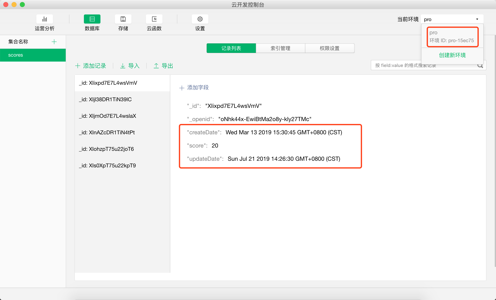

###  小游戏爱上云开发


### 游戏简介

**游戏名称：**  娇娆向日葵

**作者：** Javen

**版权：** 深圳市紫石文化传播有限公司

**开发语言：** JavaScript

**游戏引擎：** Cocos Creator v2.1.2

**注意事项：** 允许免费用于学习交流，切勿商用否则后果自负


玩法：随着音乐节奏，点击左右按钮控制场景中人物形象播放速度，操作反应越快燃烧的卡路里越多、人物形象播放速度越快。

核心功能：

1. 微信授权登录
2. 好友排行榜
3. 游戏个性化分享
4. 小程序-云开发(获取用户信息、加载配置数据、上报成绩、排行榜)
5. 资源动态加载(龙骨动画、预制资源)
6. 资源远程加载(打包后将资源放在服务器首次启动时进行远程加载)
7. 场景切换时显示加载进度


### 游戏场景介绍

该游戏比较简单，总共只使用到四个场景加微信开放域项目。

- First 场景，此场景只有一张图片，此图片与游戏包一起发布。是为了解决 IOS 进行远程加载时会出现短暂黑屏的问题
- Welcome 公司 IP 形象宣传页动画
- Loading 加载数据的过渡场景。
  - 初始化云开发环境
  - 获取 openId
  - 获取用户信息
- Home 游戏主场景
  - 初始化UI(各种 Node 节点、倒计时组件、异步加载龙骨动画、动态加载预制资源)
  - 判断是否授权，如果没有授权就动态创建button
  - 游戏逻辑实现
  - 游戏成绩上报
  - 好友排行榜

### 效果图

|                                 |                                 |                                 |
| ------------------------------- | ------------------------------- | ------------------------------- |
|  |  |  |

### 云数据库

点击图三中的 `云开发` 根据流程开通即可使用 `云函数`、`云储存`、`云数据库`

|                                       |                                        |
| ------------------------------------- | -------------------------------------- |
|  |  |


### 核心功能实现

参考文档：

- [云开发官方文档](https://developers.weixin.qq.com/minigame/dev/wxcloud/basis/getting-started.html)
- [微信小游戏 API 文档](https://developers.weixin.qq.com/minigame/dev/api/)

微信 API 常用接口的封装

- 初始化云环境
- 封装调用云函数方法
- 获取用户信息
- 创建用户信息按钮
- 调用云数据库将最新成绩上传至云端
- 微信广告接口封装


```javascript
# WxApi.js
/**
 * @author Javen 
 * @copyright 2019-03-07 19:22:21 javendev@126.com 
 * @description 微信接口
 */
let Global = require('../common/Global');

var WxApi = function() {

}
/**
 * 1、初始化云环境 
 * 2、显示分享菜单
 * 3、设置转发·小程序内容
 */
WxApi.prototype.initCloud = function(envId) {
    wx.cloud.init({
        env: envId,
        traceUser: true
    });

    //初始化数据库
    Global.wxDb = wx.cloud.database({
        env: envId
    });

    this.showShareMenu();
    this.onShareAppMessage();
}

/**
 * 封装调用云函数方法
 */
WxApi.prototype.callFunction = function(funcName, params) {
    return new Promise((resolve, reject) => {
        wx.cloud.callFunction({
            name: funcName,
            data: params || {},
            success: res => {
                resolve(res)
                console.log(`[云函数 ${funcName}] 调用成功: `, res);
            },
            fail: err => {
                resolve(null)
                console.log(`[云函数 ${funcName}] 调用失败: `, err);
            }
        })
    })
}
/**
 * 判断是否已授权
 */
WxApi.prototype.getSetting = function(scope) {
    return new Promise(function(resolve, reject) {
        wx.getSetting({
            success (res) {
                if (res.authSetting[scope]) {
                    resolve('已授权');
                } else {
                    reject('未授权');
                }
            }
        })
    });
}
/**
 * 获取用户信息
 */
WxApi.prototype.getUserInfo = function() {
    return new Promise(function(resolve, reject) {
        wx.getUserInfo({
            withCredentials: true,
            success (res) {
                resolve(res);
            },
            fail (error) {
                reject(error);
            }
        })
    });
}

WxApi.prototype.login = function() {
    return new Promise(function(resolve, reject) {
        if (cc.sys.platform == cc.sys.WECHAT_GAME) {
            wx.login({
                success (res) {
                    if (res.code) {
                        resolve(res.code);
                    } else {
                        reject(res.errMsg);
                    }
                }
            });
        } else {
            reject('非微信环境');
        }
    });
}

/**
 * 创建用户信息按钮
 */
WxApi.prototype.createUserInfoBtnByImg = function(left, top, imgUrl, width, height, callBack) {
    if (cc.sys.platform == cc.sys.WECHAT_GAME) {
        let button = wx.createUserInfoButton({
            type: 'image',
            image: imgUrl,
            style: {
                left: left,
                top: top,
                width: width,
                height: height,
            }
        });
        button.onTap((res) => {
            if (callBack) {
                callBack(res);
            }
        });
        button.show();
        return button;
    } else {
        console.log("createUserInfoBtnByImg 非微信环境...");
    }
}
/**
 * 创建打开意见反馈页面的按钮
 */
WxApi.prototype.createFeedbackButtonByImg = function(left, top, imgUrl, width, height, callBack) {
    if (cc.sys.platform == cc.sys.WECHAT_GAME) {

        let button = wx.createFeedbackButton({
            type: 'image',
            image: imgUrl,
            style: {
                left: left,
                top: top,
                width: width,
                height: height,
            }
        });
        button.onTap((res) => {
            if (callBack) {
                callBack(res);
            }
        });
        button.show();
        return button;
    } else {
        console.log("createFeedbackButtonByImg 非微信环境...");
    }
}

WxApi.prototype.getShareInfo = function(title, imageUrl, openId) {
    if (!title) {
        title = "前方高能";
    }
    if (!imageUrl) {
        imageUrl = "https://7072-pro-15ec75-1258808161.tcb.qcloud.la/static/share_01.png?sign=f246f9cc5f05eece2ae92bbd4444cc16&t=1552447069";
    }
    let query = "";
    if (!openId) {
        query = 'openId=' + openId;
    }
    return {
        title: title,
        imageUrl: imageUrl,
        query: query,
        success (res) {
            console.log("分享完成...", res);
        },
        fail (res) {
            console.log("分享失败...", res);
        }
    };
}

WxApi.prototype.showShareMenu = function() {
    if (cc.sys.platform == cc.sys.WECHAT_GAME) {
        wx.showShareMenu({
            withShareTicket: true
        });
    }
}

WxApi.prototype.onShareAppMessage = function(shareInfo) {
    if (!shareInfo) {
        shareInfo = this.getShareInfo();
    }
    if (cc.sys.platform == cc.sys.WECHAT_GAME) {
        //转发·小程序
        wx.onShareAppMessage(function() {
            return shareInfo;
        });
    } else {
        console.log("onShareAppMessage 非微信环境...");
    }
}

WxApi.prototype.shareAppMessage = function(shareInfo) {
    if (cc.sys.platform == cc.sys.WECHAT_GAME) {
        if (!shareInfo) {
            shareInfo = this.getShareInfo();
        }
        //主动分享
        wx.shareAppMessage(shareInfo);
    } else {
        console.log("shareAppMessage 非微信环境...");
    }
}

WxApi.prototype.showModal = function(title, content) {
    wx.showModal({
        title: title,
        content: content
    });
}

WxApi.prototype.showLoading = function(title) {
    return new Promise(function(resolve, reject) {
        if (cc.sys.platform == cc.sys.WECHAT_GAME) {
            wx.showLoading({
                title: title,
                mask: true,
                success (res) {
                    resolve(res);
                },
                fail (error) {
                    reject(error);
                }
            });
        } else {
            reject('非微信平台');
        }
    });
}

WxApi.prototype.hideLoading = function() {
    if (cc.sys.platform == cc.sys.WECHAT_GAME) {
        wx.hideLoading();
    }
}

WxApi.prototype.showToast = function(msg) {
    wx.showToast({
        title: msg,
        duration: 2000
    })
}


WxApi.prototype.loadVideoAd = function(adUnitId) {
    if (!Global.videoAd && cc.sys.platform == cc.sys.WECHAT_GAME) {
        let rewardedVideoAd = wx.createRewardedVideoAd({
            adUnitId: adUnitId
        });
        rewardedVideoAd.onLoad(() => {
            console.log('激励视频 广告加载成功');
            Global.videoAd = rewardedVideoAd;
            Global.videoAdLoadCount = 0;
        });
        rewardedVideoAd.onClose(res => {
            console.log('激励视频 广告关闭');
            Global.videoAd = undefined;
        });
        rewardedVideoAd.onError(err => {
            console.log('激励视频 广告加载失败');
            Global.viewAdLoadCount += 1;
            if (Global.viewAdLoadCount < 4) {
                rewardedVideoAd.load();
            }
        })
    }
}

WxApi.prototype.loadBannerAd = function(adUnitId) {
    if (!Global.bannerAd && cc.sys.platform == cc.sys.WECHAT_GAME) {

        let bannerAd = wx.createBannerAd({
            adUnitId: adUnitId,
            style: {
                left: 10,
                top: Global.windowHeight - 180,
                width: Global.windowWidth - 20,
            }
        });
        bannerAd.onError(err => {
            console.log('Banner 广告加载失败', err);
            Global.bannerAdLoadCount += 1;
            if (Global.bannerAdLoadCount < 4) {
                loadBannerAd();
            }
        });
        bannerAd.onLoad(() => {
            console.log('banner 广告加载成功');
            Global.bannerAd = bannerAd;
            Global.viewAdLoadCount = 0;
        });
    }
}

WxApi.prototype.showBannerAd = function() {
    if (Global.bannerAd) {
        Global.bannerAd.show();
    } else {
        loadBannerAd();
    }
}

WxApi.prototype.hideBannerAd = function() {
    if (Global.bannerAd) {
        // Global.bannerAd.hide();
        Global.bannerAd.destroy();
        Global.bannerAd = undefined;
        loadBannerAd();
    } else {
        console.log('不存在资源,无需关闭');
    }
}

WxApi.prototype.post = function(postUrl, params) {
    return new Promise(function(resolve, reject) {
        wx.request({
            url: postUrl,
            method: 'POST',
            header: {
                'content-type': 'application/x-www-form-urlencoded'
            },
            data: params || {},
            success: function(res) {
                resolve(res)
                console.log(`[post ${postUrl}] 调用成功: `, res);
            },
            fail: function(error) {
                reject(error);
                console.log(`[post ${postUrl}] 调用失败: `, error);
            }
        });
    });
}
/**
 * 设置用户云端数据
 */
WxApi.prototype.setUserCloudStorage = function(score) {
    return new Promise(function(resolve, reject) {
        wx.setUserCloudStorage({
            KVDataList: [{
                key: "score",
                value: score + ""
            }],
            success (res) {
                console.log("数据上报成功:", res);
                resolve(res);
            },
            fail (err) {
                console.log("数据上报失败:", err);
                reject(err);
            },
            complete () {
                console.log("数据上报完成");
            }
        });
    });
}
/**
 * 调用云函数将最新成绩上传至云端
 */
WxApi.prototype.uploadScore = function(score) {
    let that = this;
    // 1、查询成绩 
    // 2、如果没有数据就添加
    // 3、如果有数据判断是否是新纪录
    return new Promise(function(resolve, reject) {
        Global.wxDb.collection('scores').where({
            _openid: Global.openId,
        }).get({
            success (res) {
                if (res.data.length > 0) {
                    let data = res.data[0];
                    let oldScore = data.score;

                    if (oldScore < score) {
                        // 新纪录 更新
                        Global.wxDb.collection('scores').doc(data._id).update({
                            data: {
                                score: score,
                                updateDate: Global.wxDb.serverDate()
                            },
                            success (res) {
                                that.setUserCloudStorage(score);
                                // 新纪录
                                resolve(1);
                            },
                            fail (err) {
                                reject(err);
                            }
                        })
                    } else {
                        resolve(-1);
                    }
                } else {
                    // 无纪录添加数据
                    Global.wxDb.collection('scores').add({
                        data: {
                            score: score,
                            createDate: Global.wxDb.serverDate(),
                            updateDate: Global.wxDb.serverDate()
                        },
                        success (res) {
                            that.setUserCloudStorage(score);
                            // 新纪录
                            resolve(1);
                        },
                        fail (err) {
                            reject(err);
                        }
                    })
                }
            },
            fail (err) {
                reject(err);
            }
        })
    });
}

module.exports = WxApi;
```

### 适配不同平台

思路: 使用 `cc.sys.platform`  获取平台信息再做接口适配，目前只实现了  `cc.sys.WECHAT_GAME`  的接口如下： 

```javascript
const WxApi = require('./WxApi');

var wxApi = new WxApi();

function initCloud () {
    wxApi.initCloud('pro-15ec75');
}

function callFunction (funcName, params) {
    return wxApi.callFunction(funcName, params)
}

// 获取设置,判断是否授权
function getSetting (scope) {
    return wxApi.getSetting(scope);
}
// 登录获取code
function login () {
    return wxApi.login();
}

function getUserInfo () {
    return wxApi.getUserInfo();
}

// 显示准发按钮
function showShareMenu () {
    wxApi.showShareMenu();
}

// 转发·小程序
function onShareAppMessage () {
    wxApi.onShareAppMessage();
}
// 主动拉起转发
function shareAppMessage () {
    wxApi.shareAppMessage();
}

function showModal (title, content) {
    wxApi.showModal(title, content);
}

function showLoading (title) {
    wxApi.showLoading(title)
}

function hideLoading () {
    wxApi.hideLoading();
}

// 动态创建获取用户信息按钮
function createUserInfoBtnByImg (left, top, imgUrl, width, height, callBack) {
    return wxApi.createUserInfoBtnByImg(left, top, imgUrl, width, height, callBack);
}

// 动态创建反馈按钮
function createFeedbackButtonByImg (left, top, imgUrl, width, height, callBack) {
    return wxApi.createFeedbackButtonByImg(left, top, imgUrl, width, height, callBack);
}

function loadVideoAd () {
    wxApi.loadVideoAd('adunit-5b6b4a914e14b53e');
}

function loadBannerAd () {
    wxApi.loadBannerAd('adunit-0ebd781de8250e17');
}

function showBannerAd () {
    wxApi.showBannerAd();
}

function hideBannerAd () {
    wxApi.hideBannerAd();
}

function post (postUrl, params) {
    return wxApi.post(postUrl, params);
}

function uploadScore (score) {
    return wxApi.uploadScore(score);
}

module.exports = {
    initCloud: initCloud,
    getSetting: getSetting,
    login: login,
    getUserInfo: getUserInfo,
    showShareMenu: showShareMenu,
    onShareAppMessage: onShareAppMessage,
    shareAppMessage: shareAppMessage,
    createUserInfoBtnByImg: createUserInfoBtnByImg,
    createFeedbackButtonByImg: createFeedbackButtonByImg,
    loadVideoAd: loadVideoAd,
    loadBannerAd: loadBannerAd,
    showBannerAd: showBannerAd,
    hideBannerAd: hideBannerAd,
    showModal: showModal,
    showLoading: showLoading,
    hideLoading: hideLoading,
    post: post,
    callFunction: callFunction,
    uploadScore: uploadScore,
}
```

### 微信开放域

微信小游戏开放数据域使用的是旧版本实现 [参考文档](https://docs.cocos.com/creator/manual/zh/publish/publish-wechatgame-sub-domain.html)

```javascript
let ITEM_TYPE = cc.Enum({
    TOP3: 0,
    OTHERS: 1,
    SELF: 2,
});
cc.Class({
    extends: cc.Component,
 
    properties: {
        content: cc.Node,
        selfNode: cc.Node,
        prefab: cc.Prefab,
        itemBgs: {
            default: [],
            type: cc.SpriteFrame
        },
        itemNumberTop3: {
            default: [],
            type: cc.SpriteFrame
        },
        _dataArray: [],
    },
 
    start() {
        let _self = this;
 
        if (cc.sys.platform == cc.sys.WECHAT_GAME) {
            wx.onMessage(data => {
                console.log("onMessage..", data);
                if (data.message == 'getFriendRank') {
 
                    let selfOpenId = data.openId;
                    console.log("selfOpenId:", selfOpenId);
                    //清理之前的数据
                    _self.content.children.forEach(element => {
                        element.destroy();
                    });
                    _self._dataArray = [];
                    //清理之前的数据End
                    //获取好友排行榜数据
                    wx.getFriendCloudStorage({
                        keyList: ['score'],
                        success: function (res) {
                            console.log('friend success', res);
                            let length = res.data.length;
                            if (length > 0) {
                                for (let i = 0; i < res.data.length; i++) {
                                    let friendInfo = res.data[i];
                                    if (friendInfo) {
                                        let openId = friendInfo.openid;
                                        let nickName = friendInfo.nickname;
                                        let avatarUrl = friendInfo.avatarUrl;
                                        let score = friendInfo.KVDataList[0].value;
                                        _self._dataArray.push(_self._itemObj(0, openId, avatarUrl, nickName, score));
                                    }
                                }
                                //排序
                                _self._dataArray.sort(function (m, n) {
                                    if (parseInt(m.score) < parseInt(n.score)) return 1
                                    else if (parseInt(m.score) > parseInt(n.score)) return -1
                                    else return 0
                                });
                                console.log("排序后的数据:", _self._dataArray);
                                let temp = _self._dataArray.length > 10 ? 10 : _self._dataArray.length;
                                for (let index = 0; index < temp; index++) {
                                    let node = _self.createPrefab();
                                    let itemData = _self._dataArray[index];
                                    itemData.id = index + 1;
                                    _self._setItemNode(node, itemData.id < 4 ? ITEM_TYPE.TOP3 : ITEM_TYPE.OTHERS,
                                        itemData);
                                }
 
                                _self.selfNode.active = false;
                                //设置自己排名
                                for (let index = 0; index < _self._dataArray.length; index++) {
                                    let tempData = _self._dataArray[index];
                                    tempData.id = index + 1;
                                    if (selfOpenId == tempData.openId) {
                                        console.log("selfData:", tempData);
                                        _self._setItemNode(_self.createPrefab(), ITEM_TYPE.SELF, tempData);
                                        _self.selfNode.active = true;
                                        break;
                                    }
                                }
                            }
                        },
                        fail: function (res) {
                            console.error(res);
                        }
                    });
                }
            });
        } else {
            //非微信环境下的测试数据
            console.log('非微信环境...');
            for (let index = 1; index < 11; index++) {
                let node = this.createPrefab();
                let itemData = new this._itemObj(index, "", "http://192.168.1.134:12888/img/head.png",
                    "Javen", 100 + index);
                this._setItemNode(node, index < 4 ? ITEM_TYPE.TOP3 : ITEM_TYPE.OTHERS, itemData);
            }
            let itemData = new this._itemObj(100, "", "http://192.168.1.134:12888/img/head.png",
                "Javen001", 100);
            this._setItemNode(this.createPrefab(), ITEM_TYPE.SELF, itemData);
        }
    },
 
    _setItemNode(newNode, type, itemObj) {
        // 设置成绩
        newNode.getChildByName("score").getComponent(cc.Label).string = itemObj.score;
        // 设置图像
        let headNode = newNode.getChildByName("head").getChildByName("head");
        this.loadImgByUrl(headNode, itemObj.avatarUrl);
        // 设置 item 背景
        newNode.getComponent(cc.Sprite).spriteFrame = this.itemBgs[type];
        // 设置玩家昵称 
        newNode.getChildByName("bannerId").getChildByName("name").
        getComponent(cc.Label).string = this.stringTodo(itemObj.nickName, 8);
        // 设置排名
        let noNode = newNode.getChildByName("no");
        let numberNode = newNode.getChildByName("number");
        let numImgNode = newNode.getChildByName("numImg");
        noNode.active = false;
        numberNode.active = false;
        numImgNode.active = false;
 
        if (type == ITEM_TYPE.TOP3) {
            numImgNode.getComponent(cc.Sprite).spriteFrame = this.itemNumberTop3[itemObj.id - 1];
            numImgNode.active = true;
        } else if (type == ITEM_TYPE.OTHERS) {
            numberNode.getComponent(cc.Label).string = itemObj.id;
            numberNode.active = true;
        } else if (type == ITEM_TYPE.SELF) {
            if (itemObj.id <= 0) {
                noNode.active = true;
            } else {
                numberNode.getComponent(cc.Label).string = itemObj.id;
                numberNode.active = true;
            }
        }
 
        if (type == ITEM_TYPE.SELF) {
            newNode.parent = this.selfNode;
        }
    },
 
    _itemObj(id, openId, avatarUrl, nickName, score) {
        return {
            id: id,
            openId: openId,
            nickName: nickName,
            score: score,
            avatarUrl: avatarUrl,
        }
    },
 
    createPrefab() {
        let node = cc.instantiate(this.prefab);
        node.parent = this.content;
        return node;
    },
    loadImgByUrl(imgNode, remoteUrl, imageType) {
        let _self = this;
        if (!imageType) {
            imageType = "png";
        }
        cc.loader.load({
            url: remoteUrl,
            type: imageType
        }, function (err, texture) {
            if (err) {
                return;
            }
            _self.setImg(imgNode, new cc.SpriteFrame(texture));
        });
    },
    setImg(imgNode, spriteFrame) {
        imgNode.getComponent(cc.Sprite).spriteFrame = spriteFrame;
    },
    stringTodo(str, len) {
        let reg = /[\u4e00-\u9fa5]/g,
            slice = str.substring(0, len),
            chineseCharNum = (~~(slice.match(reg) && slice.match(reg).length)),
            realen = slice.length * 2 - chineseCharNum;
        return str.substr(0, realen) + (realen < str.length ? "..." : "");
    }
 
});
```

### 资源远程加载

**参考文章：** 

- [搭建微信小游戏开发环境总结](https://javen.blog.csdn.net/article/details/86545971)
- [CCC 发布到微信小游戏](https://docs.cocos.com/creator/manual/zh/publish/publish-wechatgame.html)


### 广而告知

- `TNW` 微信公众号开发脚手架：https://gitee.com/javen205/TNW
- `IJPay ` 让支付触手可及：https://gitee.com/javen205/IJPay
- `SpringBoot_Guide`  Java 后台开发练手指南 :https://gitee.com/javen205/SpringBoot_Guide 

